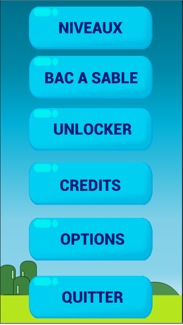
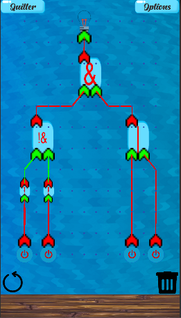
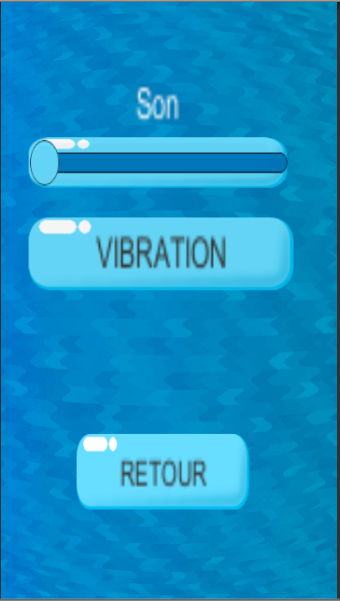

# LogicGate
LogicGate est un projet développé avec Unity. Le jeu a pour but d'apprendre aux enfants 
le concept des portes logiques de manière ludique.

## Pour contacter les Créateurs: 
devauxcedricarnaud@gmail.com
Tout retour ou avis sur notre projet est le bienvenu.

## Créateurs:
* Clain Jordan
* Devaux Cédric
* Sefer William
* Topalian Jeremy

## L'interface:

   
## Installer le jeu
Pour installer le jeu il suffit de télécharger:
* Pour Android: Il faut télécharger le fichier .apk dans le dossier LogicGateAndroid l'envoyer sur votre téléphone et le lancer. Il vous proposera ensuite de l'installer.
* Pour PC: Il faut télécharger le fichier contenu dans le dossier LogicGatePC il contient un exécutable qu'il suffit de lancer pour démarrer le jeu. (Version non réalisée un portage sera nécsessaire.)

## Editer le jeu
Pour pouvoir modifier le jeu avec Unity il faut télécharger le dossier LogicGateDev et ouvrir celui-ci comme un nouveau projet Unity.

## Documentation
Un manuel est disponible dans le wiki et la documentation sous format doxygen est disponible dans le dossier doc (le plus simple est de le telecharger et d'ouvrir ses fichiers avec votre navigateur).
