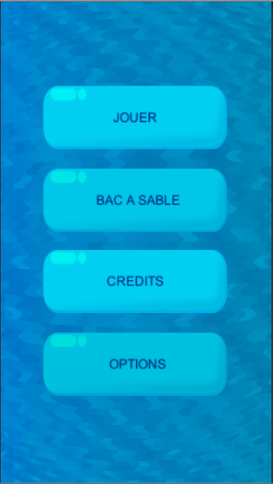

# LogicGate
LogicGate est un projet développer avec Unity de jeu ayant pour but d'apprendre aux enfants 
le concept des portes logiques de manière ludique.   

   
## Installer le jeu
Pour installer le jeu il suffit de télécharger
* Pour Android: Il faut télécharger le fichier .apk dans le dossier LogicGateAndroid l'envoyer sur votre téléphone et le lancer. Il vous proposera ensuite de l'installer.
